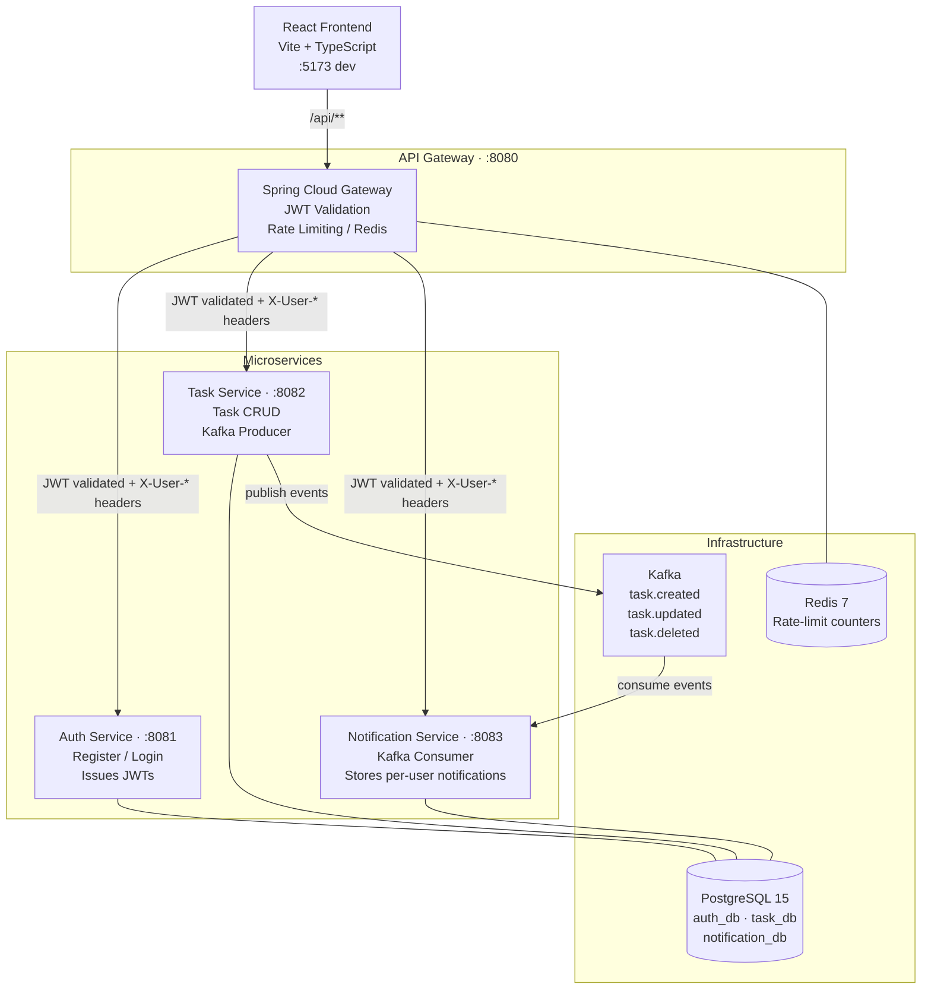

# TaskFlow — Full-Stack Task Management Application

> **Portfolio project** demonstrating microservices architecture, event-driven design, and modern full-stack development.

[](https://github.com/AaronCx/task-manager/actions/workflows/ci.yml)

---

## Architecture



### Request Flow

```
Browser → :8080 (Gateway)
           ├─ validates JWT
           ├─ rate-limits per user/IP via Redis
           ├─ strips Authorization header
           ├─ injects X-User-Id, X-User-Email, X-User-Name
           └─ routes to downstream service

Downstream services trust gateway headers — no re-validation needed.
```

### Kafka Event Flow

```
Task Service                  Kafka                 Notification Service
────────────────             ──────────────         ─────────────────────
createTask() ──publish──►  task.created   ──►  handleTaskCreated()
updateTask() ──publish──►  task.updated   ──►  handleTaskUpdated()
deleteTask() ──publish──►  task.deleted   ──►  handleTaskDeleted()
```

---

## Why Microservices?

| Concern              | Monolith                              | This Architecture                          |
|----------------------|---------------------------------------|--------------------------------------------|
| **Deployability**    | Full redeploy for any change          | Deploy each service independently          |
| **Scalability**      | Scale entire app for one bottleneck   | Scale task-service only during peak CRUD   |
| **Fault isolation**  | Auth bug → whole app down             | Auth bug → only auth-service affected      |
| **Tech diversity**   | Locked to one stack                   | Each service can evolve independently      |
| **Database schema**  | Shared schema = tight coupling        | Database-per-service (auth/task/notif db)  |

> **Trade-off acknowledged:** Microservices add operational complexity (distributed tracing, network latency, eventual consistency). For a small team the monolith-first → microservices-later pattern is realistic — this project demonstrates both sides of that journey across its feature branches.

---

## Tech Stack

### Backend (Java 17)
| Layer | Technology |
|-------|------------|
| Framework | Spring Boot 3.2.3 |
| Gateway | Spring Cloud Gateway (WebFlux) |
| Security | JWT (jjwt 0.11.5), BCrypt(12) |
| Persistence | Spring Data JPA + Hibernate |
| Databases | PostgreSQL 15 (auth_db, task_db, notification_db) |
| Messaging | Apache Kafka (Spring Kafka) |
| Rate Limiting | Redis (Spring Data Redis Reactive) |
| API Docs | SpringDoc OpenAPI 3 / Swagger UI |

### Frontend (TypeScript)
| Layer | Technology |
|-------|------------|
| Framework | React 18 + Vite |
| Styling | Tailwind CSS |
| HTTP | Axios (Bearer interceptor) |
| Routing | React Router v6 |
| Auth | In-memory JWT (never localStorage) |

### DevOps
| Tool | Purpose |
|------|---------|
| Docker + Compose | Full-stack orchestration |
| GitHub Actions | CI — build + test all services |

---

## Project Structure

```
task-manager/
├── libs/
│   └── common/                   # Shared library (JAR)
│       └── src/main/java/com/portfolio/common/
│           ├── event/TaskEvent.java        # Kafka event record
│           ├── jwt/JwtTokenProvider.java   # Shared JWT utility
│           └── security/UserContext.java   # Gateway-propagated identity
│
├── services/
│   ├── api-gateway/              # Spring Cloud Gateway — port 8080
│   │   ├── filter/JwtAuthenticationFilter.java
│   │   ├── filter/RateLimitFilter.java
│   │   └── config/KeyResolverConfig.java
│   │
│   ├── auth-service/             # Auth + user management — port 8081
│   │   └── (register, login, JWT issuance, user seeding)
│   │
│   ├── task-service/             # Task CRUD + Kafka producer — port 8082
│   │   └── (create, read, update, delete, event publishing)
│   │
│   └── notification-service/     # Kafka consumer + REST — port 8083
│       └── (consume events, persist notifications, /api/notifications)
│
├── frontend/                     # React + TypeScript + Vite
├── docker/
│   └── postgres/01-init-databases.sql   # Creates auth_db, task_db, notification_db
├── docker-compose.yml            # Full microservices stack
└── pom.xml                       # Multi-module Maven parent
```

---

## Quick Start

### Option A — Docker Compose (recommended)

```bash
# 1. Clone the repo
git clone https://github.com/AaronCx/task-manager.git
cd task-manager

# 2. Start the full stack (first run builds all images — takes ~3-5 min)
docker compose up --build

# 3. Start the frontend dev server
cd frontend && npm install && npm run dev
# → http://localhost:5173
```

### Option B — Local development

**Prerequisites:** Java 17, Maven 3.9+, Node 20, Docker (for infrastructure)

```bash
# 1. Start infrastructure only
docker compose up db redis zookeeper kafka -d

# 2. Build and install the shared library
./mvnw install -pl libs/common -am -DskipTests

# 3. Start services (each in a separate terminal)
./mvnw spring-boot:run -pl services/auth-service
./mvnw spring-boot:run -pl services/task-service
./mvnw spring-boot:run -pl services/notification-service
./mvnw spring-boot:run -pl services/api-gateway

# 4. Start the frontend
cd frontend && npm install && npm run dev
```

---

## API Reference

All requests go through the **API Gateway** at `http://localhost:8080`.

| Endpoint | Method | Auth | Description |
|----------|--------|------|-------------|
| `/api/auth/register` | POST | ❌ | Create account |
| `/api/auth/login` | POST | ❌ | Receive JWT |
| `/api/tasks` | GET | ✅ | List tasks (paginated) |
| `/api/tasks` | POST | ✅ | Create task |
| `/api/tasks/{id}` | GET | ✅ | Get task |
| `/api/tasks/{id}` | PUT | ✅ | Update task |
| `/api/tasks/{id}` | DELETE | ✅ | Delete task |
| `/api/notifications` | GET | ✅ | List notifications |
| `/api/notifications/unread-count` | GET | ✅ | Unread count |
| `/api/notifications/read-all` | PUT | ✅ | Mark all read |

**Swagger UIs** (direct service access, bypasses gateway):
- Auth:          http://localhost:8081/swagger-ui.html
- Tasks:         http://localhost:8082/swagger-ui.html
- Notifications: http://localhost:8083/swagger-ui.html

---

## Demo Credentials

Seeded automatically on first startup:

| User | Email | Password |
|------|-------|----------|
| Alice Demo | alice@demo.com | password123 |
| Bob Demo | bob@demo.com | password123 |

---

## CI / CD

GitHub Actions runs on every push to `main` and `feature/*` branches:

| Job | What it does |
|-----|-------------|
| `common` | Builds the shared library |
| `auth-service` | Builds + runs tests (H2 in-memory) |
| `task-service` | Builds + runs tests (H2, Kafka excluded) |
| `notification-service` | Builds + runs tests (H2, Kafka excluded) |
| `frontend` | TypeScript type-check + Vite production build |
| `docker` | Validates `docker compose config` syntax |

---

## Feature Branches

| Branch | Description |
|--------|-------------|
| `main` | Original monolith (single Spring Boot app) |
| `feature/kafka-notifications` | Adds Kafka events + notification microservice to the monolith |
| `feature/microservices-refactor` | Full microservices architecture (this branch) |
